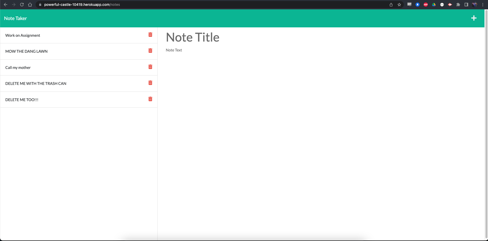

  # Express Note Taker

  ## Description
  
  This project is a note taking app that saves the title and body text of a note in an API, not in local storage. A user could view, edit, or delete notes. The front end was created for me and I created the backend.
  
  ## Table of Contents
      
  - [Installation](#installation)
  - [Usage](#usage)
  - [Starting the Program](#starting-the-program)
  - [Author](#authors)
  - [Tests](#tests)
  - [Credits](#credits)
  - [License](#license)
  
  ## Installation
  
  SSH link from https://github.com/sevrinbe/express-note-taker. Use `git clone` in the terminal and clone wherever the user wishes.

  ## Usage
  
  The use of this project is to demonstrate my ability to use Express.js and to create a basic CRUD app.
  
  

  ## Starting the Program

  To execute, in the terminal type `npm run start`. A user could also visit https://powerful-castle-10419.herokuapp.com/ to view the app deployed online.

  ## Authors
  
  Sevrin Eldred
  
  
  
  ## License
  
    This is free and unencumbered software released into the public domain.

      Anyone is free to copy, modify, publish, use, compile, sell, or
      distribute this software, either in source code form or as a compiled
      binary, for any purpose, commercial or non-commercial, and by any
      means.
      
      In jurisdictions that recognize copyright laws, the author or authors
      of this software dedicate any and all copyright interest in the
      software to the public domain. We make this dedication for the benefit
      of the public at large and to the detriment of our heirs and
      successors. We intend this dedication to be an overt act of
      relinquishment in perpetuity of all present and future rights to this
      software under copyright law.
      
      THE SOFTWARE IS PROVIDED "AS IS", WITHOUT WARRANTY OF ANY KIND,
      EXPRESS OR IMPLIED, INCLUDING BUT NOT LIMITED TO THE WARRANTIES OF
      MERCHANTABILITY, FITNESS FOR A PARTICULAR PURPOSE AND NONINFRINGEMENT.
      IN NO EVENT SHALL THE AUTHORS BE LIABLE FOR ANY CLAIM, DAMAGES OR
      OTHER LIABILITY, WHETHER IN AN ACTION OF CONTRACT, TORT OR OTHERWISE,
      ARISING FROM, OUT OF OR IN CONNECTION WITH THE SOFTWARE OR THE USE OR
      OTHER DEALINGS IN THE SOFTWARE.
      
      For more information, please refer to <http://unlicense.org/>
    
  ## Badges
  
  
 
  ## Tests
  
  N/A
